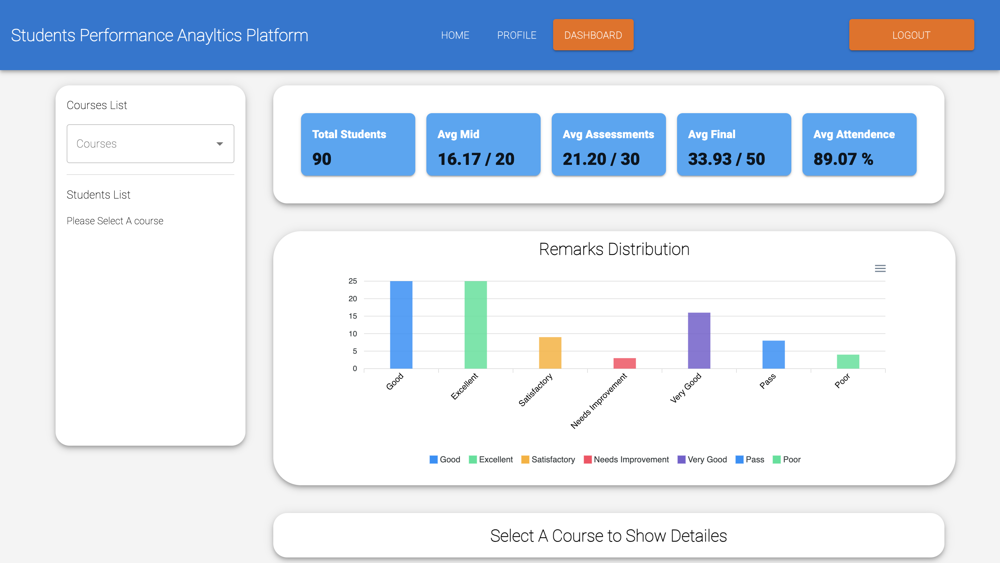
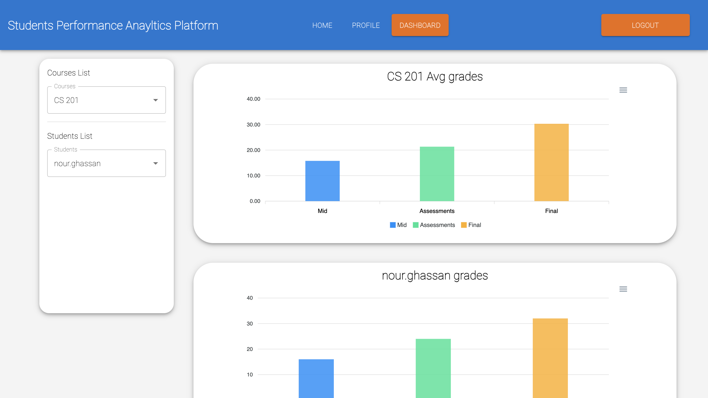
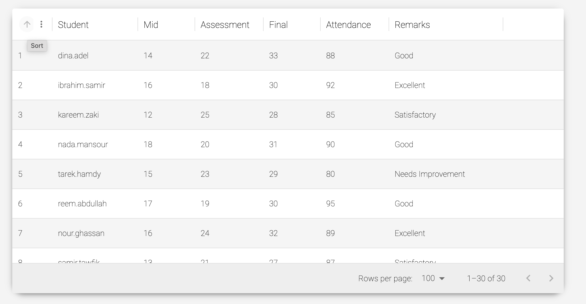
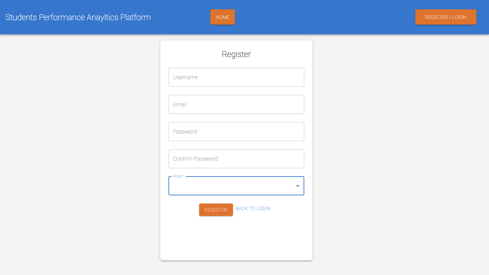
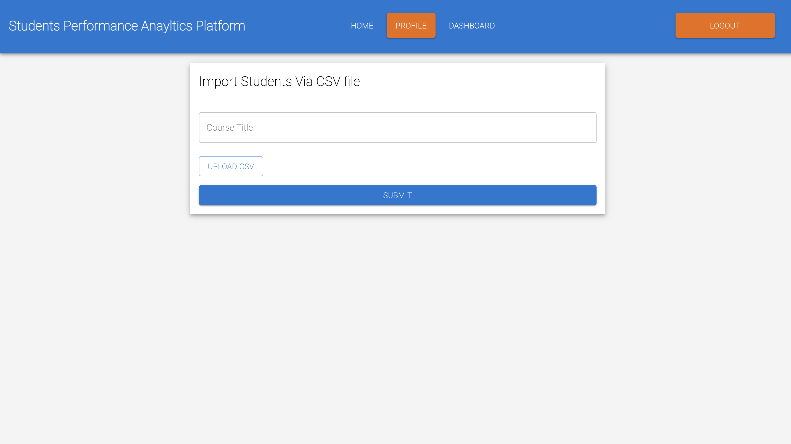
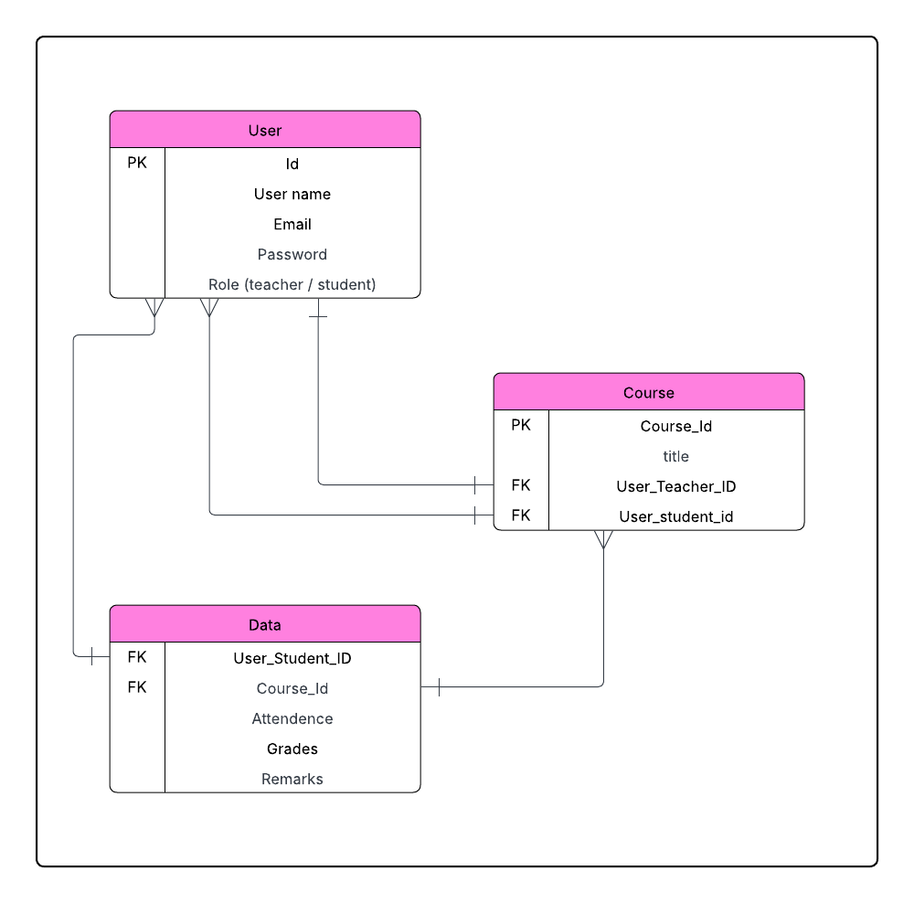

# Student Performance Analytics Platform

## 📸 Screenshots

### Dashboard

### Rest

A web-based analytics platform built with Django REST Framework (backend) and React.js (frontend).  
It provides insights into student performance with role-based access for teachers and students.

## 🚀 Features
- Role-based Registration
  - Teachers and students can register with separate roles.
- Teacher Dashboard
  - Add courses, manage students, and upload student records via CSV.
  - View analytics on:
    - Overall metrics
    - Course-level performance
    - Individual student records
- Student Dashboard
  - Students can view their own performance data.

## 🛠️ Tech Stack
- **Backend**: Django REST Framework
- **Frontend**: React.js, MUI for styling
- **Database**: (PostgreSQL)

deployed frontend: https://students-performance-client.vercel.app/
deployed server: https://studentsperformanceserver-production.up.railway.app/api/

frontend repository: https://github.com/Yusuf-ALmahroos/students_performance_client
